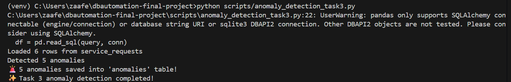
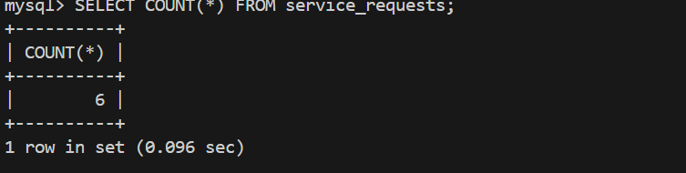
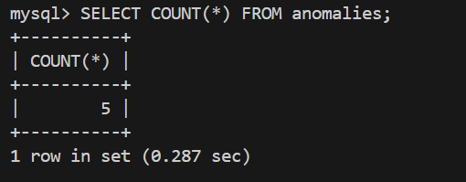
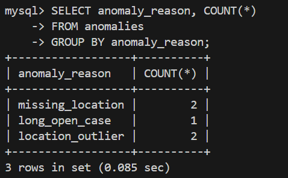

# Database Automation – Final Project

## 🤖 Task 3 – Anomaly Detection & Optimization

### 📌 Objective
Build an anomaly detection module using Python (Pandas + Scikit-learn) to identify abnormal NYC311 requests, store flagged rows in a separate table, analyze the results, and suggest performance improvements based on Signoz metrics.

---

### 🧠 Approach

| Step | Description |
|------|-------------|
| 1️⃣ Data Load | Fetched records from MySQL `service_requests` table using Pandas |
| 2️⃣ Anomaly Detection | Detected missing, long-open, and location outlier anomalies |
| 3️⃣ Save Results | Stored anomalies into a separate MySQL table called `anomalies` |
| 4️⃣ Analysis | Counted anomalies by category and verified with SQL |
| 5️⃣ Optimization | Suggested performance improvements using Signoz metrics |

---

### 🚨 Types of Anomalies Detected

| Anomaly Type | Detection Logic |
|--------------|----------------|
| missing_location | Latitude or longitude is NULL |
| long_open_case | Request open > 90 days with no closed_date |
| location_outlier | Out-of-city coordinates identified using IsolationForest ML |

---

### 📊 Results Summary

| Metric | Value |
|--------|------|
| Total records scanned | 6 |
| Total anomalies detected | 5 |
| Saved into `anomalies` table | ✔️ Yes |

Screenshots (below) prove the results:
- Record count in service_requests
- Anomalies count
- Breakdown by anomaly_reason
- Sample anomalies
- Terminal script output

(Add screenshots below)

## 📸 Screenshots

### 1️⃣ Script Execution Output


### 2️⃣ service_requests Count (6 rows)


### 3️⃣ anomalies Count (5 anomalies)


### 4️⃣ Anomaly Category Breakdown


### 5️⃣ Sample anomaly records from anomalies table


### 🎯 Why Precision/Recall Not Used
The dataset has **no ground-truth labels**, so accuracy metrics like precision and recall cannot be calculated.  
Instead, anomaly counts by type are analyzed qualitatively.

---

### 🚀 SQL Performance Optimization Based on Signoz

| Optimization | Benefit |
|-------------|---------|
| Create index on created_date + borough | Faster lookups without full scans |
| Avoid SELECT * | Less data scanned → faster response |
| Filter recent data only | Prevents scanning entire history → scalable |

Example SQL:
```sql
CREATE INDEX idx_sr_created_borough 
ON service_requests(created_date, borough);

SELECT unique_key, created_date, closed_date, latitude, longitude
FROM service_requests;

SELECT *
FROM service_requests
WHERE created_date >= NOW() - INTERVAL 30 DAY;
